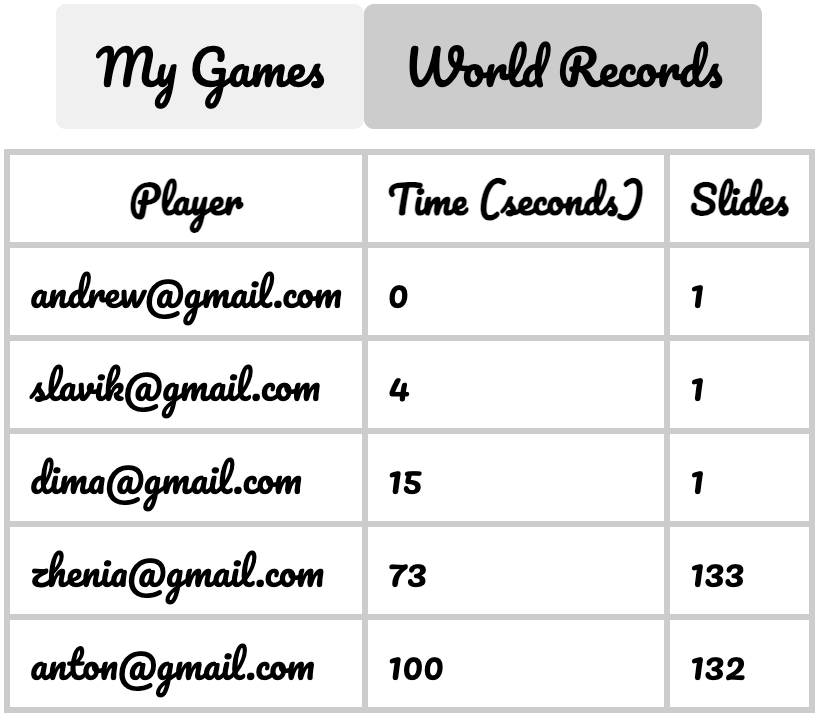

# Riddle
## Riddle is a 15 puzzle game

## Start playing for free

## See wourld fastest players

## See your previous games

## Save your result and become the best

## Unswers for possible questions
1.  Why clean or N-layered architectures were not used on the backend?
    - Yes, it may increase code readability for a little, but it will significantly increase amount of code and code duplications. 
2. Why AutoMapper of similar tools were not used?
    - Same unswer as before, we have only two enpoints and only one model to map to there is no need to use AutoMapper, Mappster, etc.

In case you have some question if I can do something or not, you can find it on my github, or ask me and I will send it to you.
